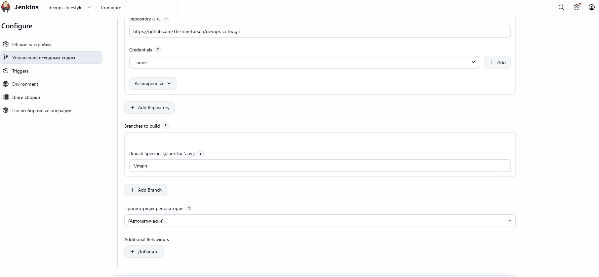
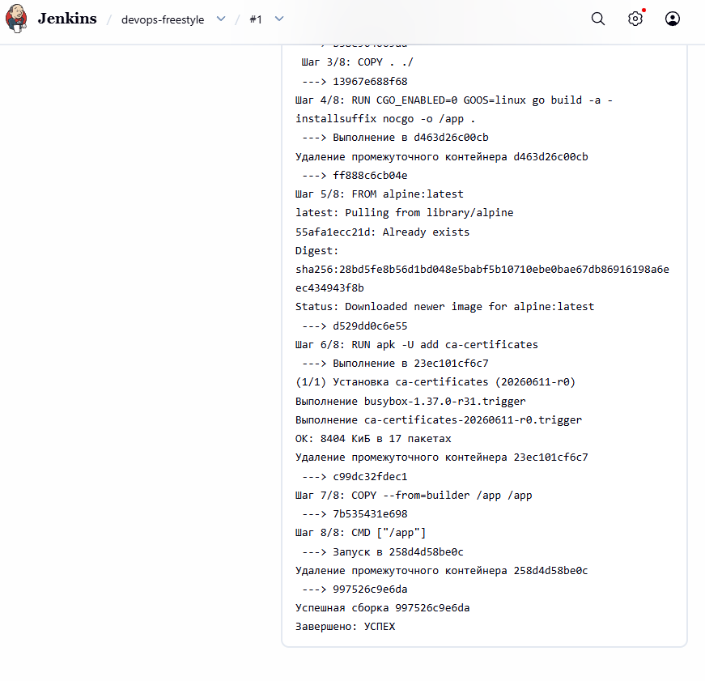
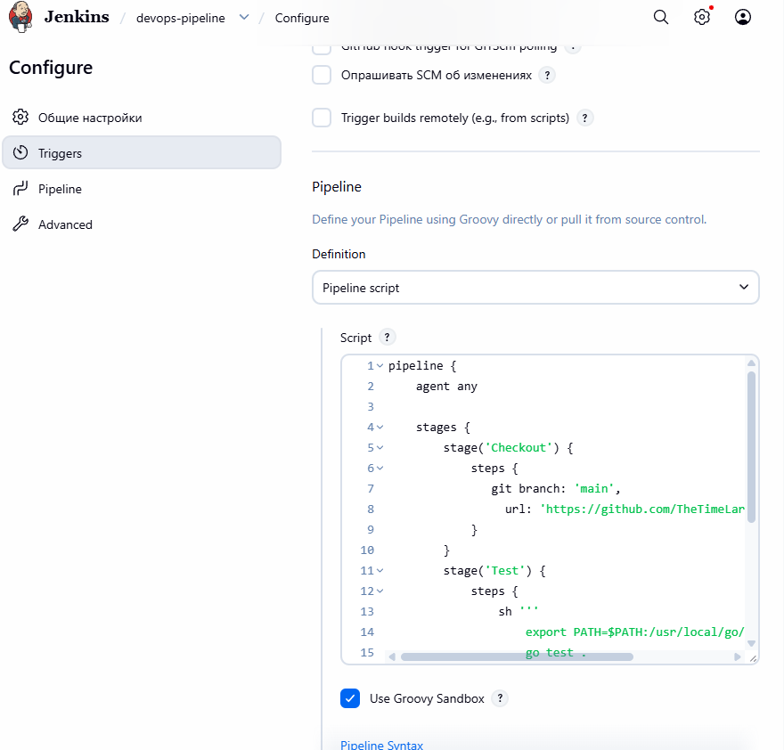
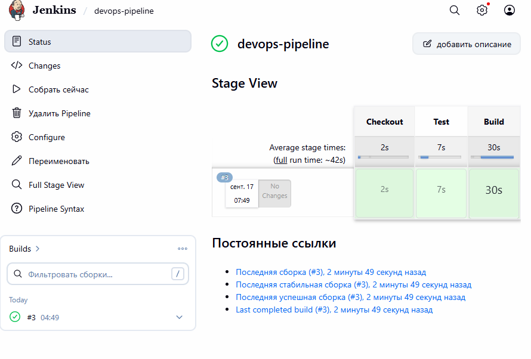
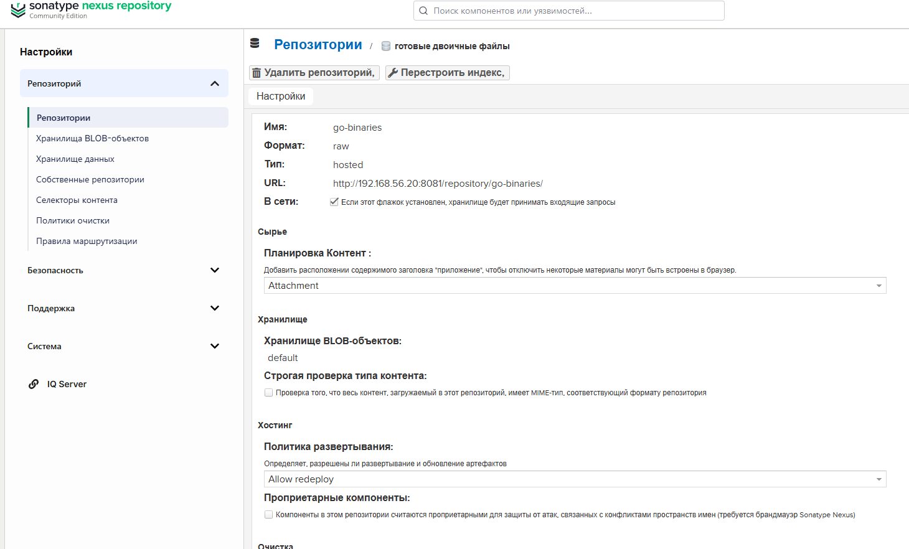
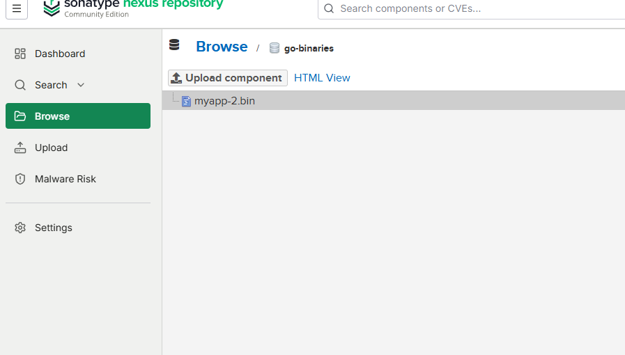

# Домашнее задание к занятию «Что такое DevOps. CI/CD»
**Ларионов Александр**

---

## Задание 1 — Jenkins Freestyle Project

### Что сделано
1. Установлен Jenkins (WAR, Java 21) на виртуальной машине (Ubuntu 18.04, IP 192.168.56.20) без Docker.
2. Установлены Go и Docker на тот же компьютер.
3. Форкнут репозиторий netology-code/sdvps-materials → TheTimeLarson/devops-ci-hw.
4. Создан Freestyle Project, подключён репозиторий, запущены go test . и docker build .

### Скриншоты

---

## Задание 2 — Jenkins Pipeline (декларативный подход)

### Что сделано
Создан pipeline-проект, сборка из Задания 1 переписана на декларативный подход.

### Скриншоты

---

## Задание 3 — Nexus

### Что сделано
1. Установлен Nexus Repository Manager (raw-hosted репозиторий go-binaries).
2. Pipeline изменён: вместо Docker-образа собирается бинарный go-файл (go build -o myapp main.go).
3. Бинарник загружен в Nexus через Jenkins (curl + credentials nexus-creds).

### Скриншоты

